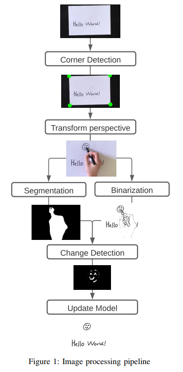

# Real Time Whiteboard Digitizer

Android app that digitizes whiteboards and papers in real time developed as part of our bachelor project at AAU (BSc Software Engineering).

## About

This app is an implementation of our paper **Digitizing Whiteboards and Papers in Real Time Using a Mobile Device**.

The system combines several techniques within the computer vision area in order to develop a complete system for capturing a whiteboard or paper and make it presentable for an audience in real time. Our system is implemented on a regular smartphone, thus enabling users to do remote presentations without requiring any extra tools. We divide our method into a number of steps, each responsible for solving a specific challenge. The steps are as follows:

1. **Corner detection** by detecting the largest edge in the picture image. This is assumed to be the whiteboard as the whiteboard should be the largest shape in the image. For each corner of the image we find the closest point in the edge and assume this is the whiteboard corner.
2. **Perspective transformation** corrects the angle of the image as the camera may not always be placed directly in front of the whiteboard. As such, we obtain a bird's eye view of the whiteboard.

3. **Segmentation** detects the part of the presenter in front of the whiteboard using a pre-trained state-of-the art segmentation model (Deeplab v3), and replaces this segment with white pixels.

4. **Binarization** binarizes the image using an adaptive threshold resulting in a simple black and white image, where pen strokes are enhanced and noise are reduced.

5. **Change detection** compares the binarized image with a stored model of the current binarized whiteboard. As the presenter has been removed from the frame, changes in this area are ignored. Remaining changes are registered into the current binarized whiteboard model.

## Dependencies

- TensorFlow Lite Task Library v0.1.0
- OpenCV Android library v3.4.14 downloaded manually from https://opencv.org/releases/ and included in project folder `openCVLibrary3414`
- Other dependencies are listed in `app/build.gradle`

## Technical details

Tested with physical device:

- Huawei Honor 7 Lite, Android OS 6.0 (API 23), 1920x1080 display

Developed using emulator with settings:

- Pixel 2, Android OS 11.0 (API 30), 1.5 GB RAM (default), 5 GB internal storage, 1920x1080 display

## Running the app

Open the project in Android Studio and run the app in an emulator (e.g. the one above) with API version >= 23

## Authors

- Christian Damsgaard
- Simon Holst
- Søren Hjorth Boelskifte
